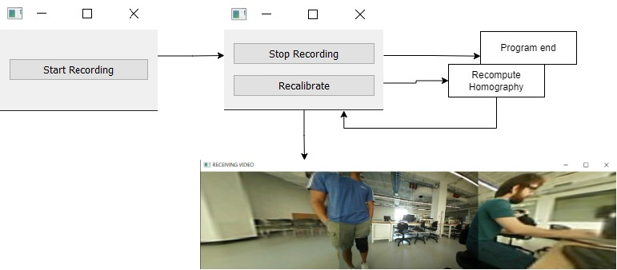

# SSLAB_3D_CAM

Created in collaboration with [SmartSystems Lab](https://smartsystems.ece.ufl.edu/)

GitHub Link: https://github.com/will-kirby/SSLAB_3D_CAM

- Software: See requirements.txt for python dependencies
- Hardware:
  - 6 USB cameras are connected to the Jetson through a USB hub.
  - 2 LEDs connected to GPIO pins on the Jetson
    - used to display the internal state.

## Overview

The system is a 360° Camera with a real-time video feed and the option to write video to a file. The system takes images from each of the 6 cameras, performs a stitching operation to merge the images into one panoramic image, and then outputs that image either to a real-time display or to a file. The system contains an NVIDIA Jetson to process the images, 6 USB cameras to capture images, a USB hub to connect the cameras to the Jetson, and a simple LED circuit to display the system state (LED’s for successful stitch as well as any errors).

The system features a logging tool for testing and debugging purposes. Given arguments, the user can perform variable tests on different camera ranges, recording durations, and stitcher algorithms. Using logs from the testing, we can create a performance report on stitching efficiency.

# Design Milestones

Check the milestones folder for prototype documentation
Design Project state spreadsheet in [shared folder](https://drive.google.com/drive/folders/1t5Ism2DB_WJJuRsHaPtqMmN0DKmHnhJA?usp=sharing) below contains individual contributions

---

## Available Scripts

### Developer

`python3 -m pip install -r requirements.txt`

Installs the required python packages/dependencies using pip package manager

`cd software/functionality_testing && python3 video_loop.py`

Runs the stitching with 2 cameras, outputing video feed. It also allows for the option to save the stitched image and intermediate images and plots the stitch times and error rate.

`cd software/performance_testing && python3 test_runner.py [..args]`

```
Run testing for given amount of time

optional arguments:
-h, --help show this help message and exit
-c CAMERAS, --cameras CAMERAS
Specify the amount of cameras
-d DURATION, --duration DURATION
Specify the duration in seconds to run the test
-i, --image Flag to take one image
```

_software/performance_testing/log_parser.ipynb_

1. Open with [Jupyter Notebook](https://jupyter.org/)
2. Change log_file with path to \*.csv
3. Plots and displays stitching performance

### User

`cd software && python3 IO_video_loop.py`
Runs video loop and displays statuses to LEDs using GPIO. Transfers file using _/software/common/copy.sh_

`cd software && python3 GUI.py`
Displays GUI for viewing stitched images (will be updated to support videos)

---

## Beta Build

#### Demo video

[](https://youtu.be/eHiNH1yC95o)

#### UI Diagram



## Specifications (Alpha Build)

### Usability

#### Interface

The UI to talk with the stitching program appears in a new window (communicating over micro USB with the Jetson). It currently contains  a start recording button to start the stitching program and display the live stitched video, a stop recording button to close the window and end the stitching program after the recording has started, and a recalibrate button that will recalibrate the homography matrices if the images are out of focus. The persistent state (saved homography matrix), is a local file on the Jetson. This can be accessed by connecting to the Jetson file system through SSH, or through the recalibrate API call.  As a visual indicator during runtime, there is an LED connected to the Jetson that lights up when the stitching program is running and working.

#### Navigation

The user interacts with the system through a GUI window that opens when the program is run on a client computer. The stitching program on the Jeston is started and stopped from the GUI. The GUI window contains clearly labeled buttons that state their purposes for starting or stopping the recording and recalibrating the homography matrix.

#### Perception

The GUI is extremely straightforward with buttons clickable by mouse that are labeled according to function.  Other students in the lab were asked to test the camera system using the GUI and buttons. They reported that the GUI was simple and intuitive for what it accomplished. The buttons briefly highlight when clicked. The start button results in the stop and recalibrate buttons replacing the start button on the GUI and a window appearing with the stitched video. The stop button results in the video window closing and the GUI returning to its initial state with only the start button. The recalibrate button results in the stitched images changing focus. Additionally, an LED indicates whether the stitching program is working properly.

#### Responsiveness

The custom stitching algorithm has no noticeable delay in image processing, and no busy-wait loops. Camera recalibration occurs within 100 ms, and if it fails it falls back on the previous result. The Jetson has an LED that illuminates when the system is working. After the stitching program is started from the GUI, the stop and recalibrate buttons are inaccessible until the camera system is initialized.

### Build Quality

#### Robustness

There are no noticeable glitches. Edge cases, such as the camera homography matrix failing to match key points results in the system falling back on a previously computed matrix. If no matrix has been previously computed, it falls back on a default saved matrix calculated from specific images. When the system boots up, it runs multiple status checks, which prevents improper configuration of the system and unexpected crashes.

Using an externally powered USB hub, using a sufficiently low frame rate and resolution (15 FPS and 320x240), and compressing video streams (MJPG) prevents sudden failure to read cameras due to power or bandwidth limitations (mostly relevant for reading from 3 to 6 cameras simultaneously).


#### Consistency

The system acts predictably.  Unpredictable results, such as serial communication failing will result in another attempt to communicate. If homography calculation fails, then the system falls back on a default precomputed matrix. Additionally, the cameras will always be read, stitched, and displayed in the same order.

#### Aesthetic Rigor

The GUI is a simple window UI that contains three buttons: a button to start recording, a button to stop recording, and a button to recalibrate camera focus. The resulting stitched video is displayed on a separate window. Additionally, the camera system is housed in a custom 3D printed hexagonal case.

### Vertical Features

- See [Alpha Test Plan](/Milestones/Alpha_Test_Plan.pdf) for User Diagram

#### External Interface

The client-side program opens two windows. One window contains buttons to control the Jetson (which runs the stitching program), while the other displays the stitched image. The user can modify the persistent state (camera homography matrix) by clicking on the recalibrate button.

#### Persistent State.

The Jetson contains a file that holds the camera homography matrices for the stitching program. These are used to compute perspective warping to overlap each of the images into one ‘panoramic’ image. This homography matrix file is modified when camera recalibration is called.

#### Internal System

The main processing step occurs when the Jetson captures images from each of the 6 (3 currently at the time of this documentation) cameras, uses the stored homography matrix to warp the 6 (3) images together, and then outputs the images to a communication bus (such as serial or network socket). 

Additionally, there is a calibration function that searches for key point matches between the images and computes a homography matrix that maps the coordinates of pixels in each image to the final coordinate system of the stitched image. At present, the images from two non-adjacent cameras that are both adjacent to the same camera are mapped to the plane of the camera in between them. The result of this calibration can be stored on the Jetson and loaded by the stitching program.